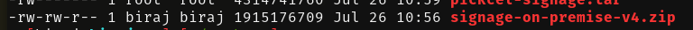
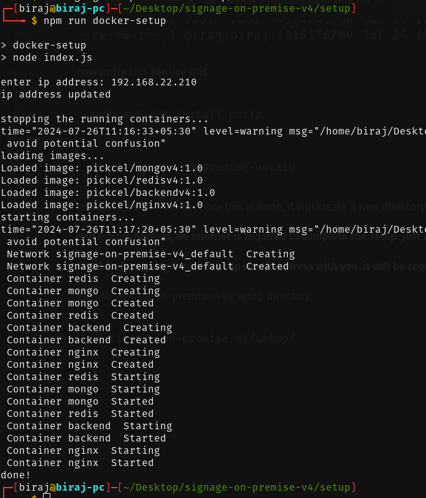

# Pickel Signage On-premise installation for Tata

NOTE: this guide assumes that you already have Pickcel's main On-premise setup guide with you.

make sure that Docker and Node.js are installed.

```bash
docker --version
node --version
```

we were already able to install Docker and Node in their system last time so we're going with this prerequisite.

in case you want to install the two again, follow the Docker & Node.js installation steps mentioned in our main installation document.


now download the on-premise setup zip file by running the following command:

```bash
curl -O https://pickceldev.s3.ap-south-1.amazonaws.com/onpremise/signage-on-premise-v4.zip
```

this will take some time depending on the internet speed.

once the file is downloaded, you will be able to use the terminal again. to verify whether the download was successful, run
```bash
ls -l
```

you should get an output like this:



now unzip this file like this:
```bash
sudo apt-get install unzip
```

```bash
unzip signage-on-premise-v4.zip
```

this will take some time. once this is done, it will create a new directory (folder) called _signage-on-premise-v4_.

**NOTE: from here on, no internet is required to complete the setup. just a network.**

**NOTE: before going forward, keep the IP address with you. it will be required.**

go into signage-on-premise-v4's setup directory.

```bash
cd signage-on-premise-v4/setup/
```



once the installation is successful, you can follow the regular steps of adding license and stuff.
